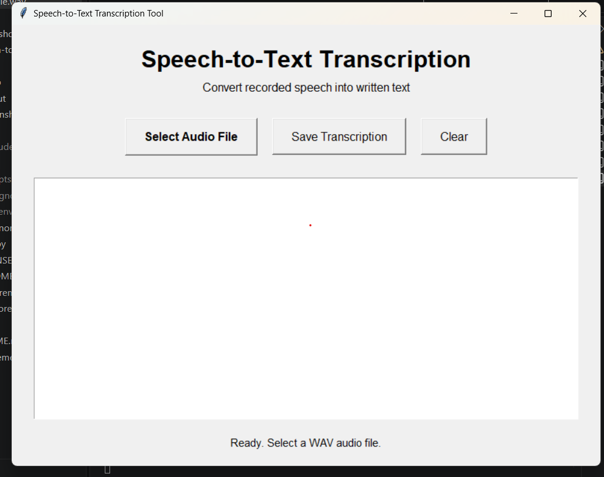

?# Speech-to-Text Transcription Tool

A Python desktop application that converts speech from WAV audio files into text using SpeechRecognition and Google Speech Recognition API.

## Features
- Select a WAV audio file
- Convert speech into text
- Display the transcription
- Save transcription as a TXT file
- Clear the transcription
- Tkinter graphical interface

## Technologies Used
- Python
- Tkinter
- SpeechRecognition
- Google Speech Recognition API

## Installation

    python -m venv venv
    .\venv\Scripts\Activate.ps1
    pip install -r requirements.txt

## Run the Application

    python app.py

## How to Use
1. Open the application.
2. Click Select Audio File.
3. Select a WAV audio file.
4. Wait for transcription.
5. Review the generated text.
6. Click Save Transcription.

## Note
An internet connection is required for Google Speech Recognition.

## Author
Vinos
## Application Screenshot

